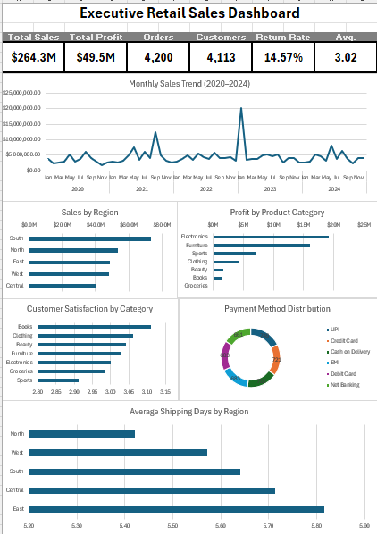

# Retail Sales Executive Dashboard

## Microsoft Excel Data Analytics Portfolio Project

### Created by Kronos Intelligence

---

# Overview

This project demonstrates an end-to-end data analytics workflow using Microsoft Excel. Beginning with a raw retail sales dataset, the project includes data profiling, data cleaning, validation, KPI development, PivotTable analysis, data visualization, and the creation of an executive dashboard.

The objective was to transform raw transactional data into meaningful business intelligence that supports executive decision-making. The finished dashboard provides insights into sales performance, profitability, customer satisfaction, operational efficiency, and payment trends.

---

# Dashboard Preview

> **Executive Dashboard Overview**
>
> The completed dashboard summarizes key business performance metrics through executive-level KPIs and interactive visualizations. It provides decision-makers with a concise view of sales trends, profitability, customer satisfaction, regional performance, payment method distribution, and shipping efficiency.

*Save your screenshot as **Dashboard_Screenshot.png** in the root of this repository.*

---

# Business Problem

Retail organizations generate large volumes of transactional data that can be difficult to interpret without effective reporting. Decision-makers require concise, accurate, and visually engaging dashboards to monitor business performance and identify opportunities for improvement.

This project demonstrates how Microsoft Excel can be used to clean, organize, analyze, and visualize retail data to support strategic business decisions.

---

# Project Objectives

- Assess overall data quality
- Clean and standardize retail transaction data
- Document all data cleaning decisions
- Develop executive-level Key Performance Indicators (KPIs)
- Build PivotTables for business analysis
- Create professional data visualizations
- Design an executive dashboard for business stakeholders

---

# Dataset

The dataset contains approximately **4,200 retail transactions** collected between **2020 and 2024**.

### Dataset Features

- Customer information
- Product categories
- Regional sales
- Order dates
- Sales revenue
- Profit
- Customer satisfaction
- Shipping performance
- Payment methods
- Return status

---

# Data Quality Process

Before performing any analysis, a comprehensive data quality assessment was completed to improve the reliability and consistency of the dataset.

### Data Cleaning Activities

- Removed blank records
- Removed duplicate transactions
- Standardized inconsistent date formats
- Corrected inconsistent text values
- Validated numerical fields
- Investigated potential outliers
- Corrected invalid values
- Standardized currency formatting
- Reviewed missing values
- Created a data dictionary
- Documented business rules
- Maintained a complete cleaning log

---

# Executive Dashboard

The completed dashboard provides executives with a concise overview of organizational performance through key performance indicators and supporting visualizations.

## Key Performance Indicators

- Total Sales
- Total Profit
- Total Orders
- Total Customers
- Return Rate
- Average Customer Satisfaction

## Dashboard Visualizations

- Monthly Sales Trend (2020–2024)
- Sales by Region
- Profit by Product Category
- Customer Satisfaction by Category
- Payment Method Distribution
- Average Shipping Days by Region

---

# Key Business Insights

Analysis of the dashboard identified several important business insights.

- The South region generated the highest overall sales revenue.
- Electronics produced the greatest total profit among all product categories.
- Books achieved the highest average customer satisfaction score.
- Average shipping times varied across regions, suggesting opportunities to improve fulfillment efficiency.
- Monthly sales remained relatively stable throughout the analysis period, with a significant increase occurring in early 2023 that warrants additional investigation.
- Customers utilized a variety of payment methods, indicating broad adoption across available payment options.

---

# Skills Demonstrated

## Data Preparation

- Data Profiling
- Data Cleaning
- Data Validation
- Data Standardization
- Data Quality Assessment

## Data Analysis

- KPI Development
- PivotTables
- PivotCharts
- Business Analysis
- Trend Analysis
- Comparative Analysis

## Data Visualization

- Executive Dashboard Design
- Data Visualization
- Chart Formatting
- Business Reporting

## Microsoft Excel Features

- PivotTables
- PivotCharts
- Structured Tables
- Dashboard Design
- Custom Number Formatting
- Excel Formulas
- Interactive Dashboard Design Principles

---

# Repository Contents

| File | Description |
|------|-------------|
| Executive Dashboard.xlsx | Complete Excel dashboard with PivotTables and visualizations |
| Retail Sales Dataset (Cleaned).xlsx | Cleaned dataset used for analysis |
| Data Quality Assessment Report.docx | Formal assessment of dataset quality |
| Cleaning Log.xlsx | Documentation of all cleaning activities |
| Data Dictionary.xlsx | Definitions and descriptions of dataset fields |
| Business Rules.xlsx | Validation rules and assumptions |
| Reflection.docx | Project reflection and lessons learned |
| README.md | Project documentation |

---

# Business Value

This project demonstrates how Microsoft Excel can transform raw business data into meaningful insights that support executive decision-making. By combining data cleaning, validation, analysis, and visualization techniques, the resulting dashboard enables stakeholders to quickly monitor organizational performance and identify opportunities for improvement.

---

# Future Enhancements

Future improvements could include:

- Add interactive slicers for dynamic filtering.
- Integrate Power Query for automated data refresh.
- Recreate the dashboard using Microsoft Power BI.
- Expand KPI calculations with additional financial metrics.
- Connect the dashboard to a live data source.

---

# Tools Used

- Microsoft Excel
- PivotTables
- PivotCharts
- Data Cleaning
- Data Validation
- Dashboard Design
- Business Analytics

---

# About Kronos Intelligence

Kronos Intelligence develops data analytics solutions that transform raw data into meaningful business intelligence. Every project emphasizes data quality, analytical accuracy, professional reporting, and executive decision support while demonstrating practical, portfolio-ready analytics skills.

---

## Author

**Tessa Becker**

Bachelor of Science in Data Analytics  
Purdue Global University

**Kronos Intelligence**

*Where Data Designs Better Decisions.*
